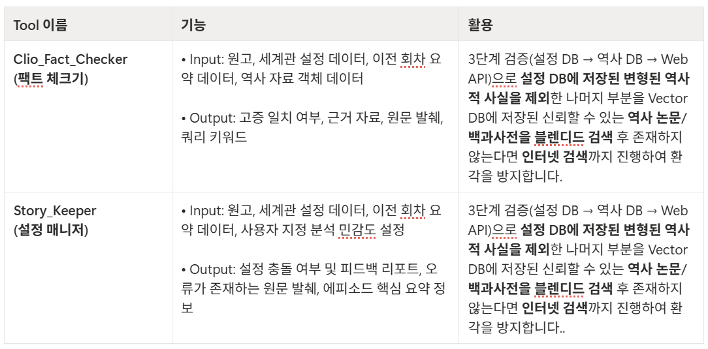
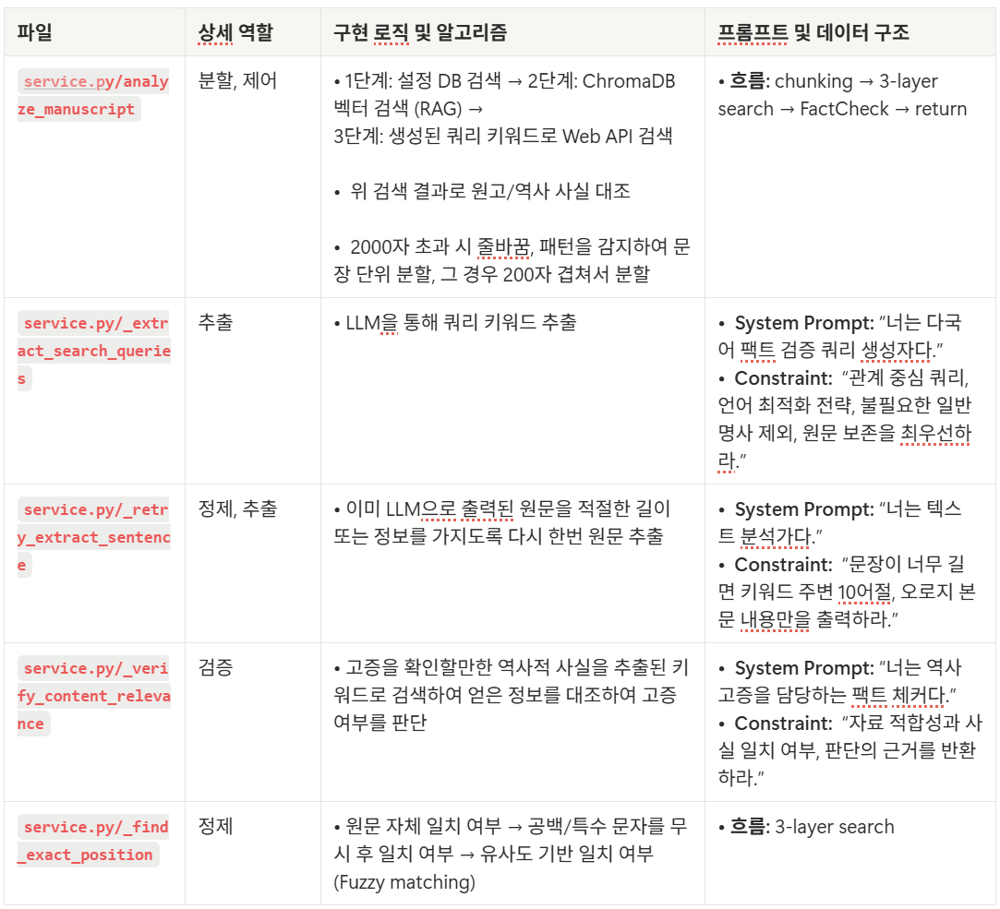
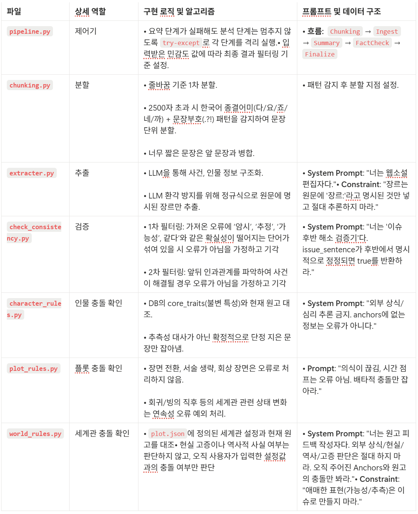

# Novelbrght Repository

강원대학교(KNU) AI 부트캠프 최종 프로젝트 제출 리포지토리입니다.

## 개요

이 리포지토리는 1팀 Novelbright의 moneta 프로젝트를 관리하고 제출하기 위한 공간입니다.

## 프로젝트 이름

Moneta: 초보 웹 소설 작가를 위한 AI 어시스턴스

- 기억의 여신(Moneta)의 이름에서 유래한 AI 어시스턴트입니다.
- 정의: 작품의 설정을 기억해 내적인 개연성에 대한 피드백을 주는 'Story Keeper'와 실제 역사 고증을 검토하는 외적 정합성에 대한 피드백을 주는 'Clio Fact Checker'중 사용자가 원하는 피드백을 받을 수 있는 에이전트입니다.

## 팀원 소개

강원대학교 컴퓨터공학과 홍윤지, 오현빈, 전진우, 최지웅

## 프로젝트 개요 및 목적

- **창작 몰입 환경 조성**
    - 초보 작가들을 위한 AI 집필 보조 도구로 작가가 ‘쓰는 것’에만 집중할 수 있는 환경을 제공합니다.
- **집필 프로세스의 효율화**
    - 방대한 세계관 설정 관리와 팩트 체크 기능을 AI에게 위임하고,  작가의 집필 속도와 퀄리티를 향상시키는 ‘최적의 집필 파트너’를 지향합니다.

## 주요 기능

### **편집 에디터**

- **자동 저장:** 타이핑을 멈추면 즉시 저장되어 데이터 유실을 방지합니다.
- **다크 모드:** 장시간 집필하는 작가의 눈 피로도를 고려한 테마를 지원합니다.
- **회차 관리:** 웹소설 형식에 맞춘 회차별 분리 및 직관적인 UI를 제공합니다.

### **체계적인 설정 관리**

- **캐릭터 카드:** 인물 프로필, 성격, 역할을 카드 형태로 시각화하여 관리합니다.
- **플롯 매니저:** 전체 줄거리(시놉시스)와 회차별 파트를 한눈에 보고 구조화합니다.
- **자료실:** 집필에 필요한 참고 자료를 업로드하고 AI가 이를 학습합니다.

## 기술 스택 및 흐름도, 아키텍처

### 기술 스택 :

Language: Python 3.12+

Web Framework: FastAPI

AI / LLM: Upstage Solar (solar-pro), LangChain (langchain-upstage)

Data Storage: JSON-based File System, Chroma DB

Infrastructure: Docker, Kubernetes (K8s), Uvicorn

-------------
### 흐름도 : 


-------------
### 아키텍처 :

Agent 구성


Clio-Fact-Checker Tool


Story-Keeper Tool


## 설치 및 실행 방법

### 필수 요구 사항
Python 3.12 이상

Docker 및 Kubernetes 환경 (배포 시 필요)

Upstage Solar API Key

SERPER.DEV API KEY

### 로컬 설치 및 환경 설정

#### 저장소 복제 및 환경 설정
git clone https://github.com/haha9430/novelbright

cd novelbright

git switch main

git pull

uv sync

#### 환경 변수 설정(.env) - 프로젝트 루트 폴더에 생성

UPSTAGE_API_KEY=your_api_key_here
SERPER_API_KEY=your_api_key_here
SOLAR_API_KEY=your_api_key_here
CHROMA_HOST=localhost

CHROMA_PORT=8000
CHROMA_COLLECTION_NAME=upstage_embeddings

#### 자동 배포(CI/CD)

이 프로젝트는 GitHub Actions를 통해 자동 배포를 지원합니다.

배포 흐름: main 브랜치에 push 발생 → Docker 이미지 빌드 → Docker Hub/Registry 푸시 → Kubernetes(K8s) 파드 재시작

kubectl create secret generic app-secret \
  --from-literal=your_api_key_here \
  --from-literal=your_api_key_here \
  --from-literal=your_api_key_here \
  -n moneta

kubectl create secret docker-registry ghcr-secret \
  --docker-server=ghcr.io \
  --docker-username={your_github_userid} \
  --docker-password={your_github_password} \
  --docker-email={your_github_email}

#### 참고: 수동 배포가 필요한 경우 

#### 프로젝트 루트 폴더에서 이미지 빌드

docker build -t moneta-backend:latest -f Dockerfile .

docker build -t moneta-frontend:latest -f Dockerfile.frontend .

#### 빌드한 이미지를 K3s가 인식하도록 가져오기

docker save moneta-frontend:latest | sudo k3s ctr --address /run/containerd/containerd.sock images import -

docker save moneta-backend:latest | sudo k3s ctr --address /run/containerd/containerd.sock images import -

#### .yaml 파일 존재 폴더로 이동

cd .../infra/k8s/application

#### k8s namespace 생성

kubectl apply -f 01-namespace.yaml

(해당 과정이 미리 진행되야 할 수도 있습니다!!)

#### ingress controller 적용

kubectl apply -f https://raw.githubusercontent.com/kubernetes/ingress-nginx/controller-v1.8.2/deploy/static/provider/cloud/deploy.yaml

#### 디버깅

sudo kubectl config set-context --current --namespace=moneta

위 명령어로 moneta namespace로 이동하기

kubectl get pods

위 명령어로  pod들이 제대로 생성되었는지 확인하기

kubectl describe pod <pod 이름>

만약에 생성이 안되었다면 위 명령어로 이유 찾아보기

kubectl logs -l app=backend -n moneta -f

kubectl logs -l app=frontend -n moneta -f

혹은 위 명령어로 로그 찍어보기

## 데모 또는 스크린샷

https://github.com/haha9430/novelbright/blob/main/NovelBright_%EC%8B%9C%EC%97%B0%EC%98%81%EC%83%81.mp4

위 링크에서 가운데 View raw 클릭하여 다운로드 후 시청 가능합니다.

## 프로젝트 구조

```
novelbright/
├── README.md                    # 본 문서
├── main.py                      # 메인
├── pyproject.toml               # 필요 라이브러리 및 설정
├── uv.lock                      # uv.lock
├── .dockerignore                # docker 환경 제외 설정
├── .gitignore                   # git 환경 제외 설정
├── .python-version              # python version
├── Dockerfile                   # backend Dockerfile
├── Dockerfile.frontend          # frontend Dockerfile
├── app/                         # 백엔드가 위치하는 디렉토리
│   ├── common/                  # 공용 툴
│   ├── core/                    # 기본 chroma db -> import 사용 
│   ├── data/                    # 로컬 데이터 저장
│   ├── repo/                    # 벡터 db 저장
│   └── service/                 # 각 에이전트와 추가 툴
│       ├── character/           # 등장 인물
│       ├── clio_fact_checker_agent/ # 역사 고증 확인 에이전트
│       ├── history/             # 역사 자료
│       └── story_keeper_agent/  # 설정 오류 확인 에이전트
├── frontend/                    # 프론트엔드가 위치하는 디렉토리
│   ├── component/               # frontend components
│   ├── api.py                   # frontend API 호출
│   └── main.py                  # frontend 메인
├── infra/                       # docker/k8s
│   └── k8s/application          # 배포 .yaml 파일(01~07)
└── .github/workflows
│   └── deploy.yml
```

---

